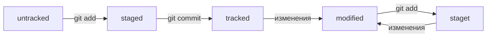

# Навигация

* pwd (от англ. <strong><em>p</em></strong><em>rint <strong>w</strong>orking <strong>d</strong>irectory</em>, «показать рабочую папку») — покажи, в какой я папке;

* ls (от англ. <strong><em>l</em></strong><em>i<strong>s</strong>t directory contents</em>, «отобразить содержимое директории») — покажи файлы и папки в текущей папке;

* ls -a — покажи также скрытые файлы и папки, названия которых начинаются с символа .;

* cd first-project (от англ. <strong><em>c</em></strong><em>hange <strong>d</strong>irectory</em>, «сменить директорию») — перейди в папку first-project;

* cd first-project/html — перейди в папку html, которая находится в папке first-project;

* cd .. — перейди на уровень выше, в родительскую папку;

* cd ~ — перейди в домашнюю директорию (/Users/Username);

* cd / — перейди в корневую директорию.

# Хэширование

Хеширование (от англ. hash, «рубить», «крошить», «мешанина») — это способ преобразовать набор данных и получить их «отпечаток» (англ. fingerprint).

Информация о коммите — это набор данных: когда был сделан коммит, содержимое файлов в репозитории на момент коммита и ссылка на предыдущий, или родительский (англ. parent), коммит. Git хеширует (преобразует) эту информацию с помощью алгоритма SHA-1 (от англ. Secure Hash Algorithm — «безопасный алгоритм хеширования») и получает для каждого коммита свой уникальный хеш — результат хеширования.
В то время, как результат работы метода hashCode() — это целое число, результат хеширования в Git — символьная строка. Она относительно коротка (40 символов в случае SHA-1) и состоит из цифр 0—9 и латинских букв A—F (неважно, заглавных или строчных). Хеш обладает следующими важными свойствами:
  1. если хеш получить дважды для одного и того же набора входных данных, то результат будет гарантированно одинаковый;
  2. если хоть что-то в исходных данных поменяется (хотя бы один символ), то хеш тоже изменится (причём сильно).

## Git log

После вызова git log появляется список коммитов с их описанием.

 Вот из каких элементов состоит описание:
  1. Строка из цифр и латинских букв после слова commit — это уже знакомый вам хеш коммита.
  2. Author — имя автора и его электронная почта.
  3. Date — дата и время создания коммита.
  4. Сообщение к коммиту.

## HEAD 

* При вызове команды git log вы также могли заметить надпись (HEAD -> master) после хеша одного из коммитов.

* Файл HEAD (англ. «голова», «головной») — один из служебных файлов папки .git. Он указывает на коммит, который сделан последним (то есть на самый новый).

* Внутри HEAD — ссылка на служебный файл: refs/heads/master. Если заглянуть в этот файл, можно увидеть хеш последнего коммита.

* Когда вы делаете коммит, Git обновляет refs/heads/master — записывает в него хеш последнего коммита. Получается, что HEAD тоже обновляется, так как ссылается на refs/heads/master.

# Mermaid-схема

HEAD -- это голова.
Коммит -- это всему голова.
Статусы файлов:

